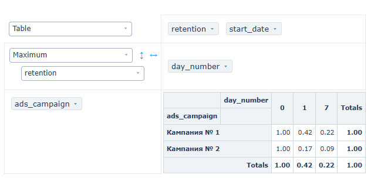

# 📌 Retention rate

## 🎯 Business Question
Which advertising campaign attracted a more loyal audience?

For each advertising campaign, I calculated the retention of the 1st and 7th days of attracted users

## 🔍 SQL Query
```sql
WITH valid_orders AS (
    SELECT 
        user_id,
        order_id,
        time::date AS order_date
    FROM user_actions
    WHERE time >= '2022-09-01' AND time < '2022-09-09'
),

campaigns AS (
    -- Campaign №1
    SELECT 
        user_id,
        order_date,
        'Кампания № 1' AS ads_campaign
    FROM valid_orders
    WHERE user_id IN (
        8631, 8632, 8638, 8643, 8657, 8673, 8706, 8707, 8715, 8723,
        8732, 8739, 8741, 8750, 8751, 8752, 8770, 8774, 8788, 8791,
        8804, 8810, 8815, 8828, 8830, 8845, 8853, 8859, 8867, 8869,
        8876, 8879, 8883, 8896, 8909, 8911, 8933, 8940, 8972, 8976,
        8988, 8990, 9002, 9004, 9009, 9019, 9020, 9035, 9036, 9061,
        9069, 9071, 9075, 9081, 9085, 9089, 9108, 9113, 9144, 9145,
        9146, 9162, 9165, 9167, 9175, 9180, 9182, 9197, 9198, 9210,
        9223, 9251, 9257, 9278, 9287, 9291, 9313, 9317, 9321, 9334,
        9351, 9391, 9398, 9414, 9420, 9422, 9431, 9450, 9451, 9454,
        9472, 9476, 9478, 9491, 9494, 9505, 9512, 9518, 9524, 9526,
        9528, 9531, 9535, 9550, 9559, 9561, 9562, 9599, 9603, 9605,
        9611, 9612, 9615, 9625, 9633, 9652, 9654, 9655, 9660, 9662,
        9667, 9677, 9679, 9689, 9695, 9720, 9726, 9739, 9740, 9762,
        9778, 9786, 9794, 9804, 9810, 9813, 9818, 9828, 9831, 9836,
        9838, 9845, 9871, 9887, 9891, 9896, 9897, 9916, 9945, 9960,
        9963, 9965, 9968, 9971, 9993, 9998, 9999, 10001, 10013,
        10016, 10023, 10030, 10051, 10057, 10064, 10082, 10103,
        10105, 10122, 10134, 10135
    )

    UNION ALL

    -- Campaign №2
    SELECT 
        user_id,
        order_date,
        'Кампания № 2' AS ads_campaign
    FROM valid_orders
    WHERE user_id IN (
        8629, 8630, 8644, 8646, 8650, 8655, 8659, 8660, 8663, 8665,
        8670, 8675, 8680, 8681, 8682, 8683, 8694, 8697, 8700, 8704,
        8712, 8713, 8719, 8729, 8733, 8742, 8748, 8754, 8771, 8794,
        8795, 8798, 8803, 8805, 8806, 8812, 8814, 8825, 8827, 8838,
        8849, 8851, 8854, 8855, 8870, 8878, 8882, 8886, 8890, 8893,
        8900, 8902, 8913, 8916, 8923, 8929, 8935, 8942, 8943, 8949,
        8953, 8955, 8966, 8968, 8971, 8973, 8980, 8995, 8999, 9000,
        9007, 9013, 9041, 9042, 9047, 9064, 9068, 9077, 9082, 9083,
        9095, 9103, 9109, 9117, 9123, 9127, 9131, 9137, 9140, 9149,
        9161, 9179, 9181, 9183, 9185, 9190, 9196, 9203, 9207, 9226,
        9227, 9229, 9230, 9231, 9250, 9255, 9259, 9267, 9273, 9281,
        9282, 9289, 9292, 9303, 9310, 9312, 9315, 9327, 9333, 9335,
        9337, 9343, 9356, 9368, 9370, 9383, 9392, 9404, 9410, 9421,
        9428, 9432, 9437, 9468, 9479, 9483, 9485, 9492, 9495, 9497,
        9498, 9500, 9510, 9527, 9529, 9530, 9538, 9539, 9545, 9557,
        9558, 9560, 9564, 9567, 9570, 9591, 9596, 9598, 9616, 9631,
        9634, 9635, 9636, 9658, 9666, 9672, 9684, 9692, 9700, 9704,
        9706, 9711, 9719, 9727, 9735, 9741, 9744, 9749, 9752, 9753,
        9755, 9757, 9764, 9783, 9784, 9788, 9790, 9808, 9820, 9839,
        9841, 9843, 9853, 9855, 9859, 9863, 9877, 9879, 9880, 9882,
        9883, 9885, 9901, 9904, 9908, 9910, 9912, 9920, 9929, 9930,
        9935, 9939, 9958, 9959, 9961, 9983, 10027, 10033, 10038,
        10045, 10047, 10048, 10058, 10059, 10067, 10069, 10073,
        10075, 10078, 10079, 10081, 10092, 10106, 10110, 10113,
        10131
    )
),

user_first_date AS (
    SELECT 
        ads_campaign,
        user_id,
        MIN(order_date) AS start_date
    FROM campaigns
    GROUP BY ads_campaign, user_id
),

daily_activity AS (
    SELECT 
        ufd.ads_campaign,
        ufd.start_date,
        ufd.user_id,  
        c.order_date,
        (c.order_date - ufd.start_date) AS day_number
    FROM user_first_date ufd
    JOIN campaigns c 
        ON ufd.user_id = c.user_id 
        AND ufd.ads_campaign = c.ads_campaign
    WHERE (c.order_date - ufd.start_date) IN (0, 1, 7)
),

-- Number of users per day (0, 1, 7) for each campaign and start_date
daily_counts AS (
    SELECT 
        ads_campaign,
        start_date,
        day_number,
        COUNT(DISTINCT user_id) AS users  
    FROM daily_activity
    GROUP BY ads_campaign, start_date, day_number
),
base_users AS (
    SELECT 
        ads_campaign,
        start_date,
        users AS base_users
    FROM daily_counts
    WHERE day_number = 0
)
SELECT 
    dc.ads_campaign,
    dc.start_date,
    dc.day_number,
    ROUND(dc.users::DECIMAL / bu.base_users, 2) AS retention
FROM daily_counts dc
JOIN base_users bu 
    ON dc.ads_campaign = bu.ads_campaign 
    AND dc.start_date = bu.start_date
ORDER BY dc.ads_campaign ASC, dc.day_number ASC;
```

---


## 📊 Analytical Insights
Despite the lower CAC and higher average order value of targeted advertising, retention for this audience was significantly lower (D7 = 9% vs. 22%). This resulted in a negative ROI for the channel.
For a delivery service, repeat orders are the key profit factor. Retention, not acquisition cost or the size of the first order, determines the long-term economics of the channel.